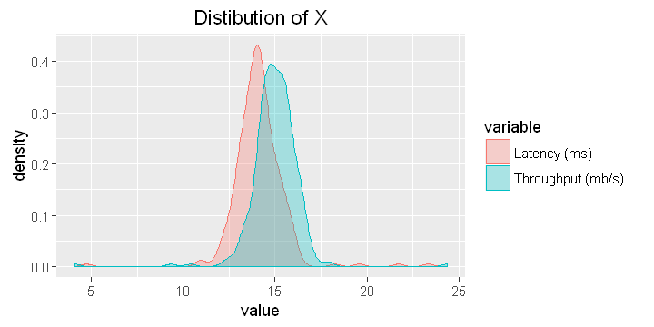
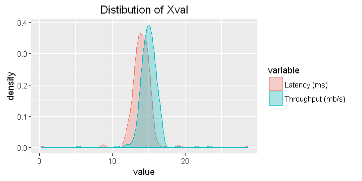
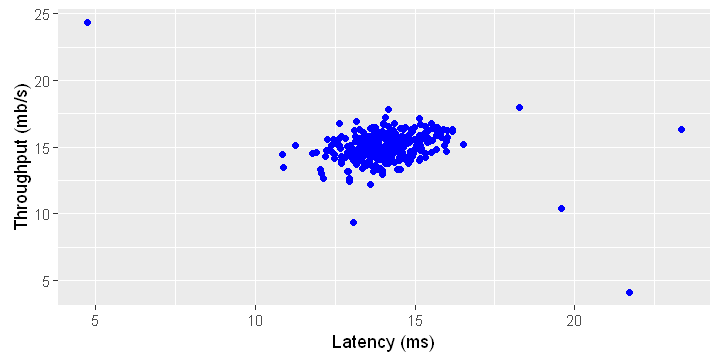
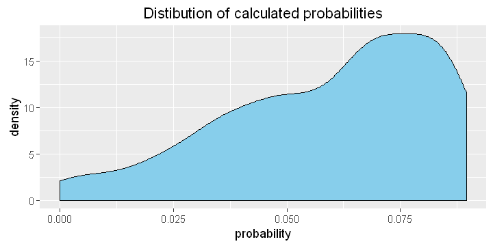
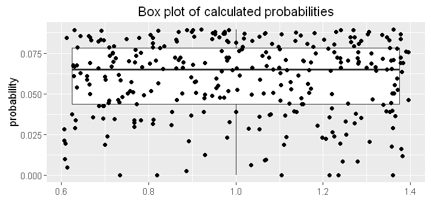
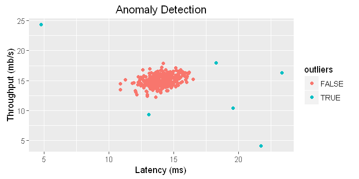
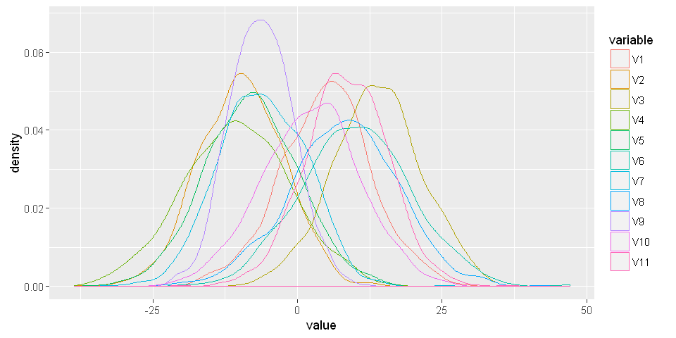
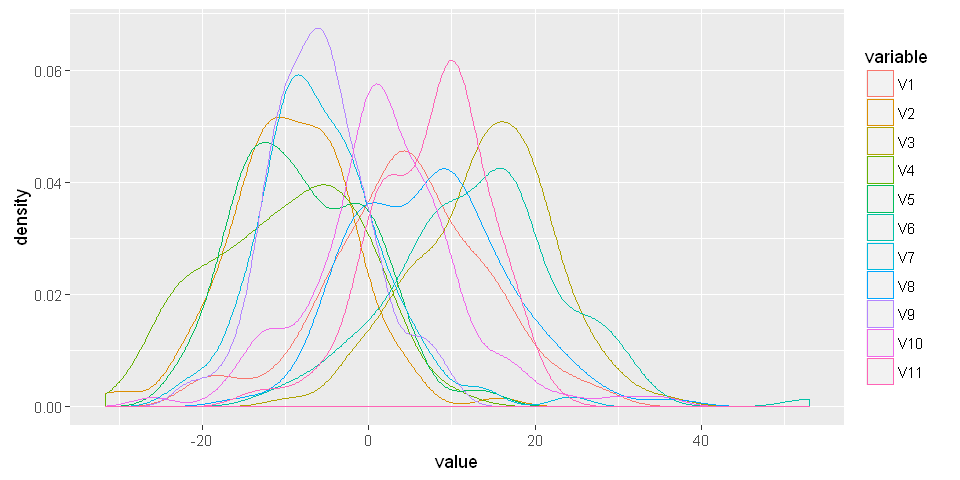

### Anomaly Detection with <strong, style="color:red"> R</strong>

Anomaly detection is used for different applications. It is a commonly used technique for fraud detection. It is also used in manufacturing to detect anomalous systems such as aircraft engines. It can also be used to identify anomalous medical devices and machines in a data center. You can read more about anomaly detection from <a href ="https://en.wikipedia.org/wiki/Anomaly_detection" target ="_blank">Wikipedia</a>.

In this blog post, we will implement anomaly detection algorithm and apply it to detect failing servers on a network. The data is from the favous Machine Learning Coursera Course by Andrew Ng. The lab exercises in that course are in Octave/Matlab. I am planning to do all the programming exercises in that course with **R** and I have started with anomaly detection.

First, we will start with 2D data and detect anomalous servers based on two features. 
We will plot the 2D data and see the algorithm's performance on a 2D plot. 
You can download the data for the first part of the exercise in RData format from
<a href="data1.RData">here</a>.

The features measure the through-put (mb/s) and latency (ms) of response of each server. We have 307 measurements.
We will use a gaussian (normal) model to detect anomalous examples in our dataset. 
We use multivariate normal distribution to detect servers with very low probabilities and hence can be 
considered anomalous (outliers). You can read about multivariate normal distribution from 
<a href ="https://en.wikipedia.org/wiki/Multivariate_normal_distribution" target ="_blank" >Wikipedia</a>.


The probability density function (pdf) of a multivariate normal is 
$$f(x)=(2\pi)^\frac{-k}{2} |\Sigma|^\frac{-1}{2}e^{-1/2(x-\mu)^{'} \Sigma^{-1}(x-\mu)}$$

$\Sigma $ is variance and $|\Sigma|$ is determinant of the variance. $\mu$ is mean and $k$ is number of columns of our data.


```R
library(magrittr)  # to use piping %>%
library(ggplot2)   # for ploting
library(MASS)      # to calculate the peseudo-inverse of a matrix
library(caret)     # to center our data by subtracting its mean
library(reshape2)  # for data manipulation
```


```R
load("data1.RData")
```


```R
#All the variables below are matrices

X=data1$X
Xval=data1$Xval   # This is cross-validation data
yval =data1$yval  # This shows which rows in Xval are anomalous
```


```R
head(X)
```


<table>
<tbody>
	<tr><td>13.04682</td><td>14.74115</td></tr>
	<tr><td>13.40852</td><td>13.76327</td></tr>
	<tr><td>14.19591</td><td>15.85318</td></tr>
	<tr><td>14.91470</td><td>16.17426</td></tr>
	<tr><td>13.57670</td><td>14.04285</td></tr>
	<tr><td>13.92240</td><td>13.40647</td></tr>
</tbody>
</table>


```R
head(Xval)
```


<table>
<tbody>
	<tr><td>15.79026</td><td>14.92102</td></tr>
	<tr><td>13.63962</td><td>15.32996</td></tr>
	<tr><td>14.86590</td><td>16.47387</td></tr>
	<tr><td>13.58468</td><td>13.98931</td></tr>
	<tr><td>13.46404</td><td>15.63533</td></tr>
	<tr><td>12.94889</td><td>16.14007</td></tr>
</tbody>
</table>


```R
table(yval)
```


    yval
      0   1 
    298   9 


From the cross-validation data, we have only nine anomalous servers but there are 298 normal servers.The main reason we can not use supervised machine learning techniques in such scenarious is because we have only a small proportion of the data as anomalous.

We will use a gaussian model to detect anomalous examples in our dataset. So, first, let's check the distribution of the variables and see if they are approximately normally distributed. If they are not close to normal distribution, we have to use appropriate transformations to get good approximations of normal distribuions.


```R
X=as.data.frame(X)
names(X)=c("Latency (ms)", "Throughput (mb/s)")
XX=melt(X)
```

    No id variables; using all as measure variables
    


```R
XX%>%ggplot(aes(x=value,fill=variable, color=variable))+
geom_density(alpha = 0.3)+ggtitle('Distibution of X')
```





As we can see, normal distribution is a good approximation for our dataset and hence we do not need to perform any transformations.

Next, let's see the distribution of the cross-validation data (Xval).


```R
Xval=as.data.frame(Xval)
names(Xval)=c("Latency (ms)", "Throughput (mb/s)")
XXval = melt(Xval)

XXval%>%ggplot(aes(x=value,fill=variable, color=variable))+
geom_density(alpha = 0.3)+ggtitle('Distibution of Xval')
```

    No id variables; using all as measure variables
    





The variables in Xval are also close to gaussian distribution. So, we do not need any transformation. 

Now, let's create a 2D plot and see the distribution of Latency and Throughput.


```R
X%>%ggplot(aes(x=`Latency (ms)`,y=`Throughput (mb/s)`))+
             geom_point(color='blue')
```





From the 2D plot above, we can visually detect the outliers and let's see if our algirithm can detect them. Remeber, the main advantage of anomaly detection algortims is specially when we have more than two measured features which is the case most of the time.

<br/>

Again, the probability density finction (PDF) is given by
$$PDF=(2\pi)^\frac{-k}{2} |\Sigma|^\frac{-1}{2}e^{-1/2(x-\mu)^{'} \Sigma^{-1}(x-\mu)}$$

$\Sigma $ is variance and $|\Sigma|$ is determinant of the variance.

In the PDF above, we have $(x-\mu)$, so, let's use the `caret` package to subtract the mean from the data points. This is called centering.


```R
# Create preProcess object
preObj <- preProcess(X,method="center")


# Center the data- subtract the column means from the data points
X2 <- predict(preObj,X)
```

Now,let's calculate variance. We will make it a diagonal matrix.


```R
X2= as.matrix(X2)
sigma2=diag(var(X2))
sigma2
```


<dl class=dl-horizontal>
	<dt>Latency (ms)</dt>
		<dd>1.83862040504188</dd>
	<dt>Throughput (mb/s)</dt>
		<dd>1.7153327338707</dd>
</dl>


```R
sigma2=diag(sigma2)
sigma2
```


<table>
<tbody>
	<tr><td>1.83862</td><td>0.00000</td></tr>
	<tr><td>0.000000</td><td>1.715333</td></tr>
</tbody>
</table>


Now, let's calculate the probabilities using the multivariate normal distribution equation given above.


```R
A=(2*pi)^(-ncol(X2)/2)*det(sigma2)^(-0.5)

B = exp(-0.5 *rowSums((X2%*%ginv(sigma2))*X2))
p=A*B
```

#### Now, let's explore the probabilities


```R
p= p%>%as.data.frame()
names(p)= c('probability')
p%>%ggplot(aes(probability))+geom_density(fill='skyblue')+
ggtitle('Distibution of calculated probabilities')
```





From the density plot above, we see there are some computer servers with very low probabilities which could be outliers. 

We can also plot a box plot of the probabilities. Here, I am also showing the points and this helps us to see the probabilities of each server.


```R
p%>%ggplot(aes(y=probability,x=1))+geom_boxplot()+
geom_jitter()+xlab('')+ggtitle("Box plot of calculated probabilities")
```





We can also create a contour plot of the probabilities and see where the servers with highest probabilities are located.


```R
X= cbind(X,p)

ggplot(X, aes(x=`Latency (ms)`, y=`Throughput (mb/s)`, z=`probability`))+ 
geom_point()+ stat_density2d(color='red')
```


From the contour plot shown above, we see that most points are near the center and the contours show relatively higher probabilities in this region. We can see that the outliers are dispersed far away from the center of mass. When we are working with 2D data, we may be able to identify the outliers visually but this techniques is specially very useful when we are working with data with more than two dimensions

To determine which of the points shown in the figure above are anomalous,we have to use cross-validation. From cross-validation, we can get the cut-off probability to classify the servers as normal or anomalous. In <code>data1.RData</code>,<strong>Xval</strong> is the validation data and <strong>yval</strong> is the actual observation of the validation data (whether the servers were anomalous or not).We will use <strong>F1 score</strong> measure to get the threshould probability and also the accuracy of our model.</

First, let's remove mean of each column from Xval.


```R
# Create preProcess object
Xval = as.data.frame(Xval)
preObj <- preProcess(Xval,method="center")

# Center the data- subtract the column means from the data points

Xval_centered <- predict(preObj,Xval)
```

Then, calculate its variance.


```R
Xval_centered = as.matrix(Xval_centered)
sigma2=diag(var(Xval_centered))
sigma2 = diag(sigma2)
sigma2
```


<table>
<tbody>
	<tr><td>2.526098</td><td>0.000000</td></tr>
	<tr><td>0.000000</td><td>1.631331</td></tr>
</tbody>
</table>


Now, let's calculate **pval** of the cross-validation data **Xval**.


```R
A=(2*pi)^(-ncol(Xval_centered)/2)*det(sigma2)^(-0.5)

B = exp(-0.5 *rowSums((Xval_centered%*%ginv(sigma2))*Xval_centered))
pval = A*B
```

For cross-validation, let's use `F1 score`, which uses `precision` and `recall`. `Precision` and `rcall` in turn are calculated using `true positive`, `false positive` and `false negative` as defined below.

**tp** is the number of true positives: the ground truth label says it's an
anomaly and our algorithm correctly classied it as an anomaly.

ˆ **fp** is the number of false positives: the ground truth label says it's not
an anomaly, but our algorithm incorrectly classied it as an anomaly.

ˆ **fn** is the number of false negatives: the ground truth label says it's an
anomaly, but our algorithm incorrectly classied it as not being anoma-
lous.


The F1 score is computed using precision (prec) and recall (rec):

$$prec = \frac{tp}{tp+fp}$$

$$rec = \frac{tp}{tp+fn}$$

$$F1 = 2.\frac{prec.rec}{prec+rec}$$


The code chunk below calculated the probability cutt-off value for the maximum possible `F1 score` through cross-validation.


```R
bestEpsilon = 0
bestF1 = 0
F1 = 0

stepsize = (max(pval) - min(pval)) / 1000

for (epsilon in seq(from =min(pval), by= stepsize,to =max(pval))){

    predictions = (pval < epsilon)*1
  
    tp = sum((predictions == 1) & (yval == 1))
    fp = sum((predictions == 1) & (yval == 0))
    fn = sum((predictions == 0) & (yval == 1))
    prec = tp / (tp + fp)
    rec = tp / (tp + fn)
    F1 = (2 * prec * rec) / (prec + rec)
    
 if (!is.na(F1)& (F1 > bestF1)==TRUE){
       bestF1 = F1
       bestEpsilon = epsilon
    
}
   }

cat("\n bestF1 =",round(bestF1,4))
cat("\n bestEpsilon =",round(bestEpsilon,4))
```

    
     bestF1 = 0.875
     bestEpsilon = 2e-04

So, from the result above, the `best F1 score` from the cross-validation is 0.875. We can use the `bestEpsilon` above as cut-off to classify probability to classify the servers as anomalous or normal.


```R
X$outliers= X$probability < bestEpsilon
X$outliers=as.factor(X$outliers)
head(X)
```


<table>
<thead><tr><th></th><th scope=col>Latency (ms)</th><th scope=col>Throughput (mb/s)</th><th scope=col>probability</th><th scope=col>outliers</th></tr></thead>
<tbody>
	<tr><th scope=row>1</th><td>13.0468151687048  </td><td>14.7411524132184  </td><td>0.0645666528169585</td><td>FALSE             </td></tr>
	<tr><th scope=row>2</th><td>13.4085201853932  </td><td>13.7632696002405  </td><td>0.0502352510157861</td><td>FALSE             </td></tr>
	<tr><th scope=row>3</th><td>14.1959148124549</td><td>15.8531811298281</td><td>0.0722651610036 </td><td>FALSE           </td></tr>
	<tr><th scope=row>4</th><td>14.914700765313   </td><td>16.1742598671581  </td><td>0.0502467728286949</td><td>FALSE             </td></tr>
	<tr><th scope=row>5</th><td>13.5766996051752  </td><td>14.0428494375565  </td><td>0.0635488729469846</td><td>FALSE             </td></tr>
	<tr><th scope=row>6</th><td>13.9224025075003  </td><td>13.4064689366608  </td><td>0.0424235784705763</td><td>FALSE             </td></tr>
</tbody>
</table>


Let's see how many outliers we have according to our model.


```R
table(X$outliers)
```


    
    FALSE  TRUE 
      301     6 


We see that we have six outliers and 301 normal servers.

Let's visualize which servers are outliers.


```R
X%>%ggplot(aes(x=`Latency (ms)`,y=`Throughput (mb/s)`))+
             geom_point(aes(color=outliers))+ggtitle('Anomaly Detection')
```





As we can see from the figure, the results of our model make sense and now we can use it for data with any number of features.

###  Part 4: Multidimensional Outliers 

We will now use the code from the previous part on a more realistic and much harder dataset. In this dataset, each example is described by 11 features, capturing many more
properties of our compute servers. You can download the RData from <a href="data2.RData">here</a>..


```R
load("data2.RData")
```


```R
X=data2$X         # has 11 columns
Xval=data2$Xval   # This is cross-validation data
yval =data2$yval  # This shows which rows in Xval are anomalous
```

First, let's explore the distribution of the variables.


```R
X%>%as.data.frame()%>%melt()%>%
ggplot(aes(x=value,color=variable))+geom_density()
```

    No id variables; using all as measure variables
    





Normal distribution seems a good approximation for this data. So, we do not need to perform any transformations.


```R
cat("Number of variables and observations of X")
dim(X)
```

    Number of variables and observations of X


<ol class=list-inline>
	<li>1000</li>
	<li>11</li>
</ol>


```R
cat("Number of variables and observations of cross-validation data")
dim(Xval)
```

    Number of variables and observations of cross-validation data


<ol class=list-inline>
	<li>100</li>
	<li>11</li>
</ol>


```R
cat("Labels of cross-validation data")
cat("\ny=0 corresponds to normal servers and y=1 corresponds to anomalous servers")
dim(yval)
```

    Labels of cross-validation data
    y=0 corresponds to normal servers and y=1 corresponds to anomalous servers


<ol class=list-inline>
	<li>100</li>
	<li>1</li>
</ol>


The Xval measures are also nearly normally distributed as shown below.


```R
Xval%>%as.data.frame()%>%melt()%>%
ggplot(aes(x=value,color=variable))+geom_density()
```

    No id variables; using all as measure variables
    





Now, following the steps we used above, let's calculate probabilities for X and Xval.


```R
# Create preProcess object
X = as.data.frame(X)
preObj <- preProcess(X,method="center")

# Center the data- subtract the column means from the data points
X2 <- predict(preObj,X)
```


```R
sigma2=cov(X2)
sigma2=diag(sigma2)
sigma2=diag(sigma2)
```

Calculate probability for X:


```R
X2= as.matrix(X2)
A=(2*pi)^(-ncol(X2)/2)*det(sigma2)^(-0.5)

B = exp(-0.5 *rowSums((X2%*%ginv(sigma2))*X2))
p = A*B
```

Next, let's calculate probabilties for the cross-validation data (Xval).


```R
# Create preProcess object
Xval = as.data.frame(Xval)
preObj <- preProcess(Xval,method="center")

# Center the data- subtract the column means from the data points

Xval_centered <- predict(preObj,Xval)
```


```R
Xval_centered = as.matrix(Xval_centered)
sigma2=diag(var(Xval_centered))
sigma2= diag(sigma2)
```


```R
A=(2*pi)^(-ncol(Xval_centered)/2)*det(sigma2)^(-0.5)

B = exp(-0.5 *rowSums((Xval_centered%*%ginv(sigma2))*Xval_centered))
pval = A*B
```

Now, we can determine the best probability threshold and also the associated `F1 score`.


```R
bestEpsilon = 0
bestF1 = 0
F1 = 0

stepsize = (max(pval) - min(pval)) / 1000

for (epsilon in seq(from =min(pval), by= stepsize,to =max(pval))){

    predictions = (pval < epsilon)*1
  
    tp = sum((predictions == 1) & (yval == 1))
    fp = sum((predictions == 1) & (yval == 0))
    fn = sum((predictions == 0) & (yval == 1))
    prec = tp / (tp + fp)
    rec = tp / (tp + fn)
    F1 = (2 * prec * rec) / (prec + rec)
    
 if (!is.na(F1)& (F1 > bestF1)==TRUE){
       bestF1 = F1
       bestEpsilon = epsilon
    
}
   }

cat("\n bestF1 =",bestF1)
cat("\n bestEpsilon =",bestEpsilon)
```

    
     bestF1 = 0.64
     bestEpsilon = 1.397136e-18

Finally, let's calculate the number of anomalous and normal servers.'


```R
probability=p
X=cbind(X,probability)
X$outliers= X$probability < bestEpsilon
X$outliers=as.factor(X$outliers)
```


```R
table(X$outliers)
```


    
    FALSE  TRUE 
      883   117


#### Summary

Anomaly detection has various applications ranging from fraud detection to anomalous aircraft
engine and medical device detection. In this blog post, we used anomaly detection algorithm to detect outliers of servers in a network using multivariate normal model. This blog post in an <strong>R</strong> version of a machine Learning programming assignment with <strong>Matlab</strong> on Coursera offered by Andrew Ng.
